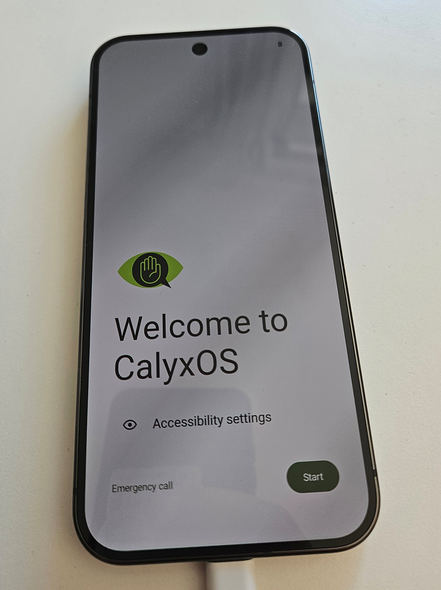

# calyxos
How to use CalyxOS to create a privacy-focussed &amp; de-Googled Smartphone

Your smartphone is spying on you. Just google it, like https://t3n.de/news/spion-jackentasche-android-1417804/?filtered=1

Especially see https://www.youtube.com/watch?v=u4rstFcPcjE

"De-Googled phones have double the battery life, since they don't call home every second"

So it might be a good idea to leave Apple behind ([already did that with my laptop](https://github.com/jonashackt/mac-to-linux)) - and also Google, because there are spying heavily using their Play Services. And now the AI trains comes into play also... 

General categories of privacy phones: https://www.youtube.com/watch?v=Cl2mPi_OeJs

# De-Googled Phones: Choose a distro based on AOSP (Android Open Source Project)

There are multiple OpenSource powered alternative OSses you can choose from. For example https://lineageos.org, https://e.foundation, https://grapheneos.org and https://calyxos.org. Most of the alternative OSses are based on the AOSP (Android Open Source Project).

https://www.youtube.com/watch?v=AkXQC0qz074

## CalyxOS vs. GrapheneOS

For me the most promising projects are CalyxOS and GrapheneOS, where there are slight differences:

https://www.reddit.com/r/PrivacyGuides/comments/13yft74/why_would_anyone_choose_calyxos_over_grapheneos/:
* main difference is: One seeks to share no information (GrapheneOS); the other is fine with sharing only fake information with google (CalyxOS). Choosing one of the other will be dependent on your threat model and that is a personal choice. 

* GrapheneOS seems to be the most frequently updated system
* GrapheneOS Sandboxes the Google Play services as they are & the user controls, what they are allowed to send to Google. Calyx uses MicroG (https://github.com/microg/GmsCore) (like https://e.foundation). This means you can talk to Google Play services, though in a better, more privacy-conscious way. MicroG is an open implentation of Google Play Services.

https://news.ycombinator.com/item?id=28091157:
> "Calyx has more focus on functionality and privacy rather than security. On Graphene, security is always priority #1.

"If you want an allround phone to use everyday (and use things like Uber, Facebook, etc) but more private and secure than AOSP, take Calyx. Do you want security over everything and are willing to compromise a bit on functionality and app compatibility (some apps will refuse to run without google play), pick Graphene."

https://blog.usro.net/2024/11/grapheneos-vs-calyxos-the-ultimate-privacy-showdown/

That's also the reason, why https://www.youtube.com/watch?v=u4rstFcPcjE advises to use CalyxOS, since the company offers support for multiple OpenSource OSses and they experience the least customer issues with this OS.

Experience reports for CalyxOS:
* https://www.reddit.com/r/CalyxOS/comments/17vux8r/experience_with_daily_driving_calyxos_for_a_month/
* https://www.reddit.com/r/CalyxOS/comments/sc9yut/my_experience_using_calyxos_on_a_pixel_6_pro/

So for me in the end it comes down to personal choice. As for a general purpose phone with __much more privacy__ than a default phone, I would suggest CalyxOS. 

## CalyxOS and GrapheneOS mainly support Google Pixel phones

CalyxOS some other devices, but both CalyxOS and GrapheneOS support every Google Pixel phone.

So as I want to have the latest hardware (camera!!), I choose the Google Pixel 9 Pro, which has an even better camera than a iPhone 16+:

https://www.connect.de/testbericht/google-pixel-9-pro-test-3207428.html

It also features as great result in the radiation tests done by the connect magazine: https://www.connect.de/vergleich/strahlungsarme-handys-bestenliste-1500639.html

# Going CalyxOS

## Install CalyxOS on Google Pixel 9 Pro

https://calyxos.org/install/devices/caiman/

The easiest way to install CalyxOS is to use the web installer. Use a browser like Chrome/ium for that, since Firefox won't work. There's not much to do to prepare for the web installer:

### Remove SIM card
On brand new devices, especially those obtained from a carrier, it’s better to remove the SIM card from the device before starting it for the first time, to help with the “OEM Unlocking” step below.

### Enable Developer Options
Settings → About Phone → tap Build number 7 times

### Enable OEM Unlocking
Settings → System → Advanced → Developer Options → OEM unlocking

This step might fail if there is no internet connection. In that case, connect to a WiFi network and then try again.

### Put your device into bootloader mode

by restarting it and holding the volume down button until you see a red warning sign or green Android robot.

Once your device is in bootloader mode, plug it into the computer or device you’re installing from.

If everything went fine, you should have CalyOS on your phone in no time:

## Compatibility with "special apps"

### Banking Apps

Banking apps seem to often work, but often also not: https://grapheneos.org/usage#banking-apps 

Here's an overview including GitHub issues for every bank: https://privsec.dev/posts/android/banking-applications-compatibility-with-grapheneos/

https://www.reddit.com/r/CalyxOS/comments/1gelv7o/does_calyx_os_work_with_banking_apps/

### Android Auto

CalyxOS has Android Auto support build in since February 2025 https://calyxos.org/news/2025/02/22/15-february-feature-update/ and it works really well. You need to install some Google apps from Aurora Store in the setup process to be to have Android Auto working. Like:

* Google Speech Recognition & Synthesis App https://play.google.com/store/apps/details?id=com.google.android.tts

In my car (VW Caddy 5), my Google Pixel 9 Pro with CalyxOS is working fine with Android Auto.

See also https://github.com/sn-00-x/aa4mg

### Duolingo

You need to install Google Speech Recognition & Synthesis App from Aurora Store (also needed for Android Auto).

As stated here https://duolingoguides.com/why-my-duolingo-mic-not-working/:

"After installing Google TTS, you must give it the right permissions. This lets Duolingo and Google TTS use your microphone. You can change these settings in your device’s privacy manager, depending on your OS."

Simply go to Authorization manager in the settings app and give Google TTS the permission to use your microphone.

# Links

Going back to stock Android: https://flash.android.com/welcome

Browser privacy tests: https://privacytests.org/android

Great overview on AOSP: https://yourdevice.ch/android-die-fassade-der-offenheit-broeckelt/

https://www.androidauthority.com/google-android-development-aosp-3538503/

__BUT__: There is this https://www.youtube.com/watch?v=4To-F6W1NT0 going on (same as the comments in news.ycombinator.com/item?id=28091157, so I personally will not use Graphene)